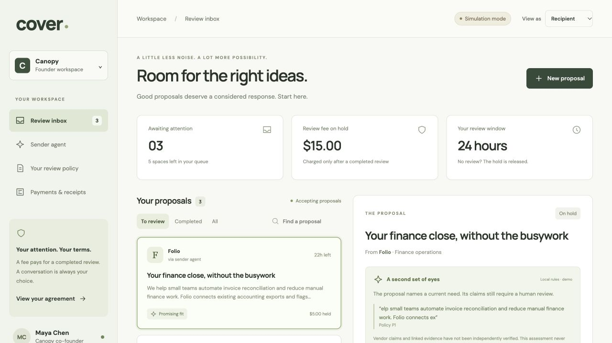

# Browser verification

Verified October 3, 2026 against the local production build.

- A quote-backed, confirmed human review produced a simulated capture receipt.
- Sender appeal held the recipient earning; independent operator refund reversed it.
- Sender mandate, fit assessment, exact-policy consent, and proposal admission completed in the browser.
- Advancing the demo clock voided unreviewed proposals.
- Operator reset restored three synthetic proposals and cleared the simulated mandate and review history.
- Desktop, 375 px phone, and 812 px landscape layouts had no horizontal page overflow. No browser console errors were observed during these flows.

This is manual browser verification, not a claim of real PayPal transactions, model accuracy, or complete accessibility certification.

